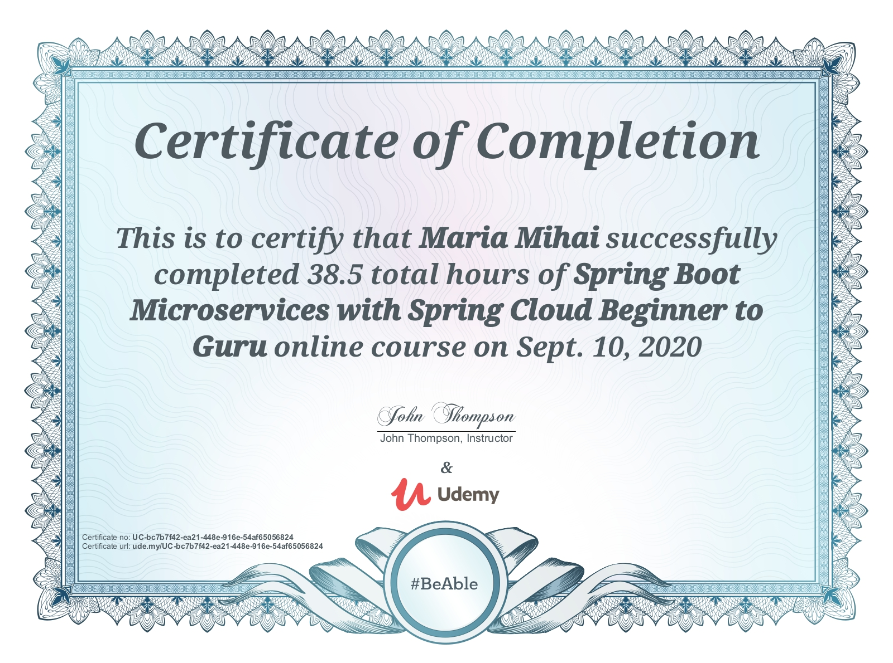
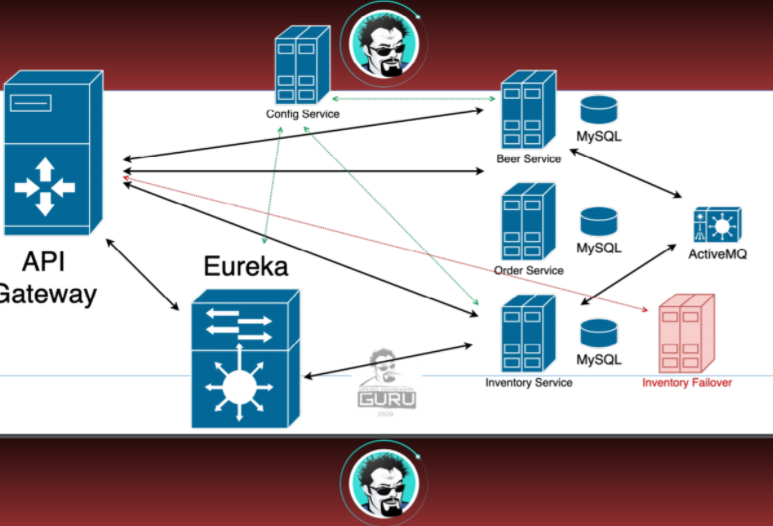

# Spring Boot Microservices with Spring Cloud
Overview of the entire course and all the projects from "Spring Boot Microservices with Spring Cloud" [Udemy course](https://www.udemy.com/course/spring-boot-microservices-with-spring-cloud-beginner-to-guru/). 



  - [Main project](#main-project)
    - [Description](#description)
    - [The monolith](#the-monolith)
    - [The microservices](#the-microservices)
      - [Developed microservices](#developed-microservices)
      - [Additional applications needed](#additional-applications-needed)
        - [MySQL](#mysql)
        - [JMS with ActiveMQ Artemis](#jms-with-activemq-artemis)
        - [Distributed Tracing with Spring Cloud Sleuth and Zipkin](#distributed-tracing-with-spring-cloud-sleuth-and-zipkin)
        - [ELK Stack overview](#elk-stack-overview)
      - [Default port mapping - for single host](#default-port-mapping---for-single-host)
      - [Docker images](#docker-images)
  - [Additional projects constructed in this course](#additional-projects-constructed-in-this-course)
    - [Initial Brewery projects](#initial-brewery-projects)
    - [Spring REST Docs example project](#spring-rest-docs-example-project)
    - [Jackson project](#jackson-project)
    - [Brewery BOM](#brewery-bom)
    - [JMS messaging project](#jms-messaging-project)
    - [Spring Statemachine project](#spring-statemachine-project)

## Main project
### Description
The main project revolves around a three service environment - a beer creation project, an inventory one and an order 
creation, validation and allocation project.

These three and all the other projects are described in their respective README files. Current project is only an overview 
of the development done during this course.

### The monolith
The course trainer added an initial project, the monolith from which the services are constructed from, but I decided to 
implement it myself. The code is found [here](./udemy-sbm-brewery-monolith), uses CircleCI for CI 
and Sonar Cloud for code quality.

### The microservices
#### Developed microservices
Overview of all the developed microservices taken from the course:


The services: <br/>
[Eureka Service](./udemy-sbm-brewery-eureka) <br/>
[Config Service](./udemy-sbm-config-server) (repository used: [Git repo](./udemy-sbm-brewery-config-repo)) <br/>
[Gateway Service](./udemy-sbm-brewery-gateway) <br/>
[SBM Beer Service](./udemy-sbm-beer-service) <br/>
[SBM  Beer Order Service](./udemy-sbm-beer-order-service) <br/>
[SBM Beer Inventory Service](./udemy-sbm-beer-inventory-service) <br/>
[SBM Beer Inventory Failover Service](./udemy-sbm-beer-inventory-failover) <br/>

#### Additional applications needed
For the needed applications I've used Docker containers.

##### MySQL
The [Beer Service](./udemy-sbm-beer-service), [Beer Inventory Service](./udemy-sbm-beer-inventory-service) 
and [Beer Order Service](./udemy-sbm-beer-order-service) each need a database connection.

When running locally, I am using a Docker container for the MySQL databases. Check the Docker Hub [MySQL page](https://hub.docker.com/_/mysql).

Creating the container:
```
docker run -p 3306:3306 --name beer-mysql -e MYSQL_ROOT_PASSWORD=root_pass -d mysql:8
```

The initial scripts for each database needed by the services are under `src/main/scripts/mysql-init.sql` file, on each 
individual repo.

##### JMS with ActiveMQ Artemis
The communication between the three main projects is done via JMS. Check the Docker project [here](https://github.com/vromero/activemq-artemis-docker/blob/master/README.md).

Creating the container:
```
docker run -it --rm -p 8161:8161 -p 61616:61616 vromero/activemq-artemis
```

The existing queues are:
- `brewing-request` - send a brew request from Beer Service to make more inventory
- `new-inventory` - Beer Service sends update with the newly brewed beers to the Beer Inventory Service
- `validate-order` - Beer Service receives request for validating an order from the Beer Order Service
- `validate-order-result` - Beer Service sends the validation result back to the Beer Order Service
- `allocate-order` - Beer Inventory Service validates the allocation of an order received from the Beer Order Service
- `allocate-order-response` - Beer Inventory Service sends the result of the allocation to the Beer Order Service
- `allocate-order-failed` - not implemented - Beer Order Service receives an exceptional case for the failed allocation (database issue, etc.)
- `de-allocate-order` - Beer Inventory Service receives a deallocation request from the Beer Order Service if the order was invalidated

| Property | Value | 
| --------| -----|
| username | artemis |
| password | simetraehcapa | 

##### Distributed Tracing with Spring Cloud Sleuth and Zipkin
I am using Spring Cloud Sleuth to inject tracing information into the service calls and Zipkin to see the transactions 
as they are moving between services. Check the Docker Hub [Zipkin page](https://hub.docker.com/r/openzipkin/zipkin).

For the purpose of this course, a database (namely Cassandra) was not added.

Creating the Zipkin container:
```
docker run --name zipkin -p 9411:9411 openzipkin/zipkin
```

##### ELK Stack overview
Filebeat, Elasticsearch and Kibana projects were added for centralized logging.


The logback file for each project is defined under `src/resources/logback-spring.xml`. The projects for which the logs 
are currently collected are only the Beer Service, Beer Inventory Service and Beer Order Service.

The docker compose .yaml file defining the containers needed for centralized logging is defined in the current project, 
under `/docker/local-logging/compose-logging.yaml`.

#### Default port mapping - for single host

| Service Name                                                               | Port | 
|----------------------------------------------------------------------------| -----|
| [Eureka Service](./udemy-sbm-brewery-eureka)                               | 8761 |
| [Config Service](./udemy-sbm-config-server)                                | 8888 |
| [Gateway Service](./udemy-sbm-brewery-gateway)                             | 9090 |
| [SBM Beer Service](./udemy-sbm-beer-service)                               | 8080 |
| [SBM  Beer Order Service](./udemy-sbm-beer-order-service)                  | 8081 |
| [SBM Beer Inventory Service](./udemy-sbm-beer-inventory-service)           | 8082 |
| [SBM Beer Inventory Failover Service](./udemy-sbm-beer-inventory-failover) | 8083 |

#### Docker images
Links for the Docker images of each project are set in the READMEs of each project.

Automatic building was not implemented for this project. The `latest` tag contains the best implementation considered 
appropriate to be used.

For automatic building of Docker images check the next projects:
- for [CircleCI](https://github.com/mariamihai/CIToDockerExampleProject)
- for [TravisCI](https://github.com/mariamihai/sma-overview) (all projects implemented under the "Spring Microservices in Action" book)

The current project contains docker compose .yaml files for running all the microservices and additional projects needed.
The initial file is under `/docker/local/compose.yaml` and an additional one including centralized logging was added under 
`/docker/local-logging/compose-logging.yaml`.

## Additional projects constructed in this course
### Initial Brewery projects
Two projects were developed initially - a [Brewery](./udemy-sbm-brewery) and a [Brewery Client](./udemy-sbm-brewery-client).
They deal mostly with understanding the domain, MVC, Lombok, MapStruct, API versioning, bean validation, error handling, RestTemplate, etc.

### Spring REST Docs example project
Using REST Docs for documenting a Spring Boot project. Code [here](./udemy-sbm-restdocs).

### Jackson project
Processing JSON with Spring Boot project. Code [here](./udemy-sbm-jackson).

### Brewery BOM
Initially developed BOM for the microservices. Link to project [here](./udemy-sbm-brewery-bom).

Currently using the course creator [BOM project](https://github.com/sfg-beer-works/sfg-brewery-bom).

### JMS messaging project
An initial project about JMS messaging which was expanded by using it with the microservices. Code [here](./udemy-sbm-jms).

### Spring Statemachine project
An initial project to familiarize with Spring Statemachine was developed [here](./udemy-sbm-ssm).
